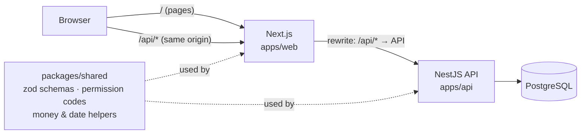
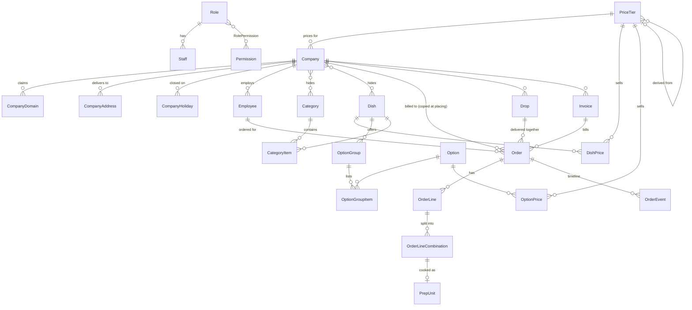

# Fernleaf Kitchen: Operations Admin Panel

Admin panel for a corporate meal-delivery kitchen: catalogue and pricing, companies and employees, orders with cut-offs, kitchen and dispatch boards, a driver view, and company invoicing. Next.js, NestJS, Prisma and PostgreSQL, built for the Heizen assignment.

- Live app: https://fernleaf-kitchen-admin-frontend.vercel.app
- API health: https://fernleaf-kitchen-admin-backend.onrender.com/health
- Repository: https://github.com/veer-mehta/fernleaf-kitchen-admin

The API is on Render's free tier; after a quiet period the first request can take up to a minute.

## Running locally

Needs Node 22, pnpm 12 and Docker.

```bash
docker compose up -d            # PostgreSQL on localhost:5432
cp .env.example .env
pnpm install                    # also builds the shared package and the Prisma client
pnpm --filter api db:deploy     # create tables
pnpm --filter api db:seed       # accounts and demo data
pnpm dev                        # API :4000, web :3000
```

`pnpm lint`, `pnpm typecheck`, `pnpm test`. Tests use a separate database; run `pnpm --filter api db:test` once to create it.

The seed creates the four role accounts from the brief and generates demo orders around today's date, so every screen has data on any day. Demo orders are re-based on the first start or hourly check of each new day, and from Settings → Refresh demo data; orders created by hand are never touched.

## Architecture



- `apps/api`: NestJS + Prisma. All business rules live here, one folder per feature.
- `apps/web`: Next.js, TanStack Query, Tailwind + shadcn/ui. No business rules, no server actions.
- `packages/shared`: zod schemas, permission codes, money and date helpers used by both.

The browser only talks to the Next.js origin, which rewrites `/api/*` to the API, so the login cookie is first-party. In the API, `JwtAuthGuard` loads the user and permissions on every request, `PermissionsGuard` denies any route without a declared permission, zod validates input, and one filter returns errors as `{ code, message, fields? }`.

Roles are rows in `Role`, `Permission` and `RolePermission`; no code checks a role name (a test scans for it). Another test walks every route against all four accounts.

## Data model



Portion sizes (`PortionSize`, `GroupPortion`, `OptionPortion`) are omitted from the diagram. Full schema: `apps/api/prisma/schema.prisma`.

- Dishes are deactivated, never deleted. They reach the menu through ordered categories; a company can hide categories or single dishes.
- Prices are rows per tier. A tier can derive from cost (`x multiplier`) or another tier (+/- percent); derived rows carry an `isOverride` flag so typed prices survive recalculation. One default tier, enforced by a partial unique index. No row means not sold on that tier.
- An order copies dish name, SKU, station, options and prices when placed, so later edits never change it.
- Confirming an order creates one prep unit per distinct combination. Orders for the same company, address and exact time share a drop. `Order.invoiceId` is one nullable column, so an order is on at most one invoice.
- Money is integer cents. Derived prices round up to the next 5 cents in integer arithmetic; the UI parses amounts as strings, never floats.

## Decisions and trade-offs

- **Tier prices stored as rows.** Menus and the missing-price report are plain queries. A recalculation must run when a rule or cost changes; it does, and is tested.
- **Permissions loaded on every request.** Role changes apply at once, at the cost of one query per request.
- **Lazy lock plus a background job.** Free hosting sleeps, so correctness cannot depend on a job. An order can briefly show as placed after its cut-off but can never be edited.
- **Cookie auth with an Origin check on writes.** httpOnly, `SameSite=Lax`, `Secure`; the API rejects a write whose `Origin` is not `WEB_ORIGIN`, so the app must be opened at exactly that address.
- **Photos stored in PostgreSQL.** Free hosts wipe local files on deploy. The browser shrinks photos to 1280 px JPEG; the server accepts JPEG, PNG or WebP up to 1 MB and checks the file's bytes. At scale this would move to object storage.
- **One kitchen time zone, Asia/Kolkata.** Delivery dates are plain dates, and cut-offs, "today" and "late" are computed in that zone, never the server's or browser's. Tests run with other process time zones and a fake clock to prove it.
- **Concurrency by guarded updates.** Every status change is `updateMany WHERE status = <expected>`, so of two simultaneous requests the loser matches 0 rows and gets a 409. Kitchen actions also write the order row first (a row lock), invoicing claims orders with one `updateMany` that must match exactly the selected orders, and cut-off processing is idempotent. Each has a test that holds two requests at a barrier so they really overlap.
- **Tests run on a real PostgreSQL.** Locks and transactions are the point of several rules, so mocks would prove nothing.

## Dashboards

Each role lands on its own dashboard, and each figure is defined on the page too. "Today" means today in the kitchen's time zone (Asia/Kolkata), not in the viewer's or the server's. Cancelled and rejected orders are not counted unless stated.

**Admin** needs to see what needs attention and what is owed.

| Figure | Calculation |
|---|---|
| Orders by status | Orders with the chosen delivery date (default today) by current status; every status listed. |
| Active orders and value | Same date, all statuses except cancelled and rejected (drafts included); value is the sum of `totalCents`. |
| Confirmed, not yet invoiced | Confirmed or delivered orders with no invoice, all dates, per company and total. |
| Next 7 days | Delivery dates today to today + 6, per day. |
| Missing prices | Per tier, active dishes and options with no price row. They vanish from menus on that tier. |

**Kitchen** needs to know what to cook and what is about to be late.

| Figure | Calculation |
|---|---|
| To cook / cooking / done | Prep units of confirmed or delivered orders for the date, by status. Delivered orders stay in, so "done" does not shrink during the day. |
| By station | Same units by the station on the order line; none means Unassigned. |
| Late / at risk | Units not done after, or within 30 minutes before, the planned kitchen-ready time (delivery time - company delivery minutes, default 60 - kitchen buffer, default 30). |
| Next deadlines | The next 5 orders with unfinished units, by that time. |

**Dispatch** needs to know which drops are blocked or late.

| Figure | Calculation |
|---|---|
| Drops by status | Drops for the date with a confirmed or delivered order: waiting for kitchen, ready, out, delivered. |
| Without a driver / late | Undelivered drops with no driver; undelivered drops past their delivery time. |
| On-time rate | Drops delivered by delivery time plus the grace setting (default 0), divided by drops delivered, as a whole percent. "None yet" when nothing is delivered, never 0%. |

**Driver** shows the signed-in driver's drops for today in time order, filtered by driver id on the server. No profit figures or charts: costs are typed by hand, and plain numbers are easier to check.

## Ambiguities and how I read them

1. **Cut-off counting.** It counts back N kitchen working days from the delivery date, not counting the date itself, skipping non-working days and kitchen holidays (2 days at 16:00: a Wednesday delivery locks Monday 16:00). Only the kitchen calendar moves it; a company's own calendar decides which days it accepts deliveries.
2. **After the cut-off** nobody can create an order or edit its dishes, admins included, because the kitchen plan is built from them. Admins can still cancel, reject (before confirmation) and override delivery time, address and packaging. Orders lock at the cut-off instant even if the background job has not confirmed them yet.
3. **Delivered.** An order becomes delivered when its drop is marked delivered. Kitchen ready, dispatch ready and out for delivery are recorded as timestamps; the status stays confirmed until then.
4. **Choices on a dish.** One option per group; a required group needs exactly one. Combinations with identical choices must be merged, and their quantities must add up exactly to the line quantity.
5. **Unpriced and hidden items.** A dish or option with no price on the employee's tier is absent from their menu, as is a dish whose required group has nothing left. Secret categories are not listed, but staff can still order their dishes.
6. **Invoiced orders** (the brief asks for a decision). They are locked, with no cancel and no override, until their invoice is voided, which is only possible while it is unpaid. Voiding releases the orders.

## Scope

Built: every [Must] item (4.1-4.11) and both [Should] items, portion sizes and CSV employee import with row-level errors. Tests cover cut-off, pricing resolution, combination counting, invoicing, kitchen concurrency, access control, dispatch, photo upload and CSV import.

Next: CSV import for companies and dishes, full-text search and cursor pagination for large lists, live board updates instead of polling, and browser end-to-end tests.
